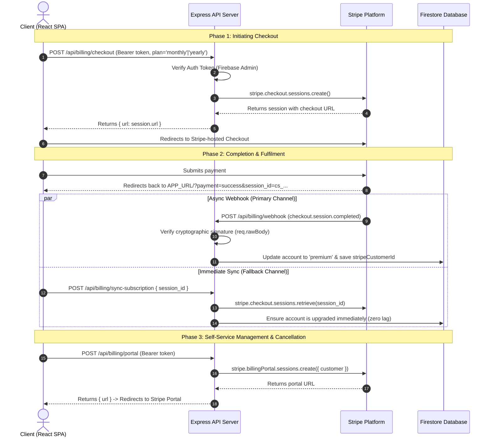

# Stripe Subscription Integration Guide

> **Purpose:** A complete, production-ready specification and architectural blueprint for integrating Stripe subscriptions with Firebase/Node.js.  
> **Intended Audience:** Developers and AI assistants (e.g. Gemini, Antigravity) replicating this subscription pattern in another project.  
> **Language & Locale:** British English.

---

## 1. Executive Overview & Architecture

This integration provides a secure, robust, and self-healing recurring subscription system built on **Stripe Checkout**, **Stripe Webhooks**, **Stripe Customer Portal**, and a **Node.js/Express** backend paired with **Firebase Firestore**.



### Core Architectural Principles
1. **Zero Client Trust:** The frontend never directly modifies subscription or billing status in the database. Security rules strictly forbid client writes to `subscriptionTier` or `subscriptionStatus`.
2. **Account/Tenant Sharing:** Subscriptions attach to the shared account/family entity (`families/{familyId}`), allowing all group members to share premium benefits under a single subscription.
3. **Dual Fulfilment Pipeline (Webhook + Sync Fallback):** Webhooks are the primary source of truth, but asynchronous network delay can lead to a jarring experience where a user returns from payment and does not immediately see their upgrade. The `/api/billing/sync-subscription` endpoint provides an immediate, synchronous verification check on return.
4. **Graceful Cancellation:** When a user cancels, they retain access until the end of the paid billing cycle (`cancel_at_period_end: true`). Access is only revoked once Stripe issues the `customer.subscription.deleted` webhook event.

---

## 2. Stripe Dashboard Configuration

Before writing code, configure your Stripe Dashboard (in Test mode first, then replicated to Live):

### 2.1 Products & Prices
1. Navigate to **Product catalogue** > **Add product**.
2. Create your subscription product (e.g. `App Premium`).
3. Add two recurring pricing models:
   - **Monthly Price:** e.g. £7.95/month recurring. Note the Price ID: `price_xxxxxxxxxxxxxxxxxxxx`.
   - **Yearly Price:** e.g. £79.00/year recurring. Note the Price ID: `price_yyyyyyyyyyyyyyyyyyyy`.

### 2.2 Customer Portal
1. Navigate to **Settings** > **Billing** > **Customer portal**.
2. Enable:
   - Switching plans (Monthly ↔ Yearly).
   - Updating payment methods (Card, Apple Pay, Google Pay).
   - Cancelling subscriptions (set to "At the end of billing period").
   - Viewing invoice and receipt history.
3. Set your application return URL to `https://yourdomain.com/?view=settings&fromStripe=true`.

### 2.3 Webhooks
1. Navigate to **Developers** > **Webhooks** > **Add endpoint**.
2. Set Endpoint URL: `https://yourdomain.com/api/billing/webhook`.
3. Select the following events:
   - `checkout.session.completed` (Subscription purchased/initialised)
   - `customer.subscription.updated` (Plan changed, renewed, or status changed to cancelled)
   - `customer.subscription.deleted` (Subscription terminated/expired)
   - `invoice.payment_failed` (Renewal payment failed)
4. Reveal and record the **Signing secret** (`whsec_...`).

---

## 3. Environment Configuration

Define these variables in your server environment (`.env` locally, Secret Manager in production):

```env
# Stripe API Keys (from https://dashboard.stripe.com/apikeys)
STRIPE_SECRET_KEY="sk_live_..."

# Stripe Webhook Signing Secret (from https://dashboard.stripe.com/webhooks)
STRIPE_WEBHOOK_SECRET="whsec_..."

# Stripe Price IDs for Subscription Tiers
STRIPE_PRICE_ID_MONTHLY="price_1U0LNyJzUUmzIl9XtVTb93C6"
STRIPE_PRICE_ID_YEARLY="price_1U0LOZJzUUmzIl9XNhlQ3t7i"

# Optional: Fallback Direct Payment Links
STRIPE_PAYMENT_LINK_MONTHLY="https://buy.stripe.com/..."
STRIPE_PAYMENT_LINK_YEARLY="https://buy.stripe.com/..."

# Application Base URL
APP_URL="https://yourdomain.com"
```

---

## 4. Firestore Data Model & Security Rules

### 4.1 Schema Definition

#### `users/{userId}` (Private User Profile)
```typescript
interface UserDocument {
  email: string;
  familyId: string; // ID of the shared group or tenant
  stripeCustomerId?: string; // Stored on the paying user for Customer Portal lookups
}
```

#### `families/{familyId}` (Shared Group / Tenant)
```typescript
interface FamilyDocument {
  name: string;
  subscriptionTier: 'free' | 'premium'; // Source of truth for feature gates
  cancelAtPeriodEnd?: boolean;          // True if user scheduled cancellation
  currentPeriodEnd?: string | null;     // ISO timestamp when paid access expires
  isBetaTester?: boolean;               // Administrative bypass flag
}
```

#### `users/{userId}/private/billing` (Trial & Bypass Metadata)
```typescript
interface BillingPrivateDocument {
  trialEndsAt?: FirebaseFirestore.Timestamp; // 21-day reverse trial expiration
  isBetaTester?: boolean;
}
```

### 4.2 Firestore Security Rules
Prevent malicious clients from upgrading their own subscriptions:

```javascript
rules_version = '2';
service cloud.firestore {
  match /databases/{database}/documents {
    
    // Helper function
    function isUserDoc(userId) {
      return request.auth != null && request.auth.uid == userId;
    }

    // Users Collection
    match /users/{userId} {
      // Allow user to create profile, but NEVER with premium subscriptionTier
      allow create: if isUserDoc(userId) && 
        (!('subscriptionTier' in request.resource.data) || request.resource.data.subscriptionTier == 'free');
      
      // Allow user updates, but BLOCK any changes to subscriptionTier or stripeCustomerId
      allow update: if isUserDoc(userId) &&
        !request.resource.data.diff(resource.data).affectedKeys().hasAny(['subscriptionTier', 'stripeCustomerId']);
    }

    // Families / Account Collection
    match /families/{familyId} {
      allow read: if request.auth != null;
      // Client writes can NEVER modify subscriptionTier, cancelAtPeriodEnd, or currentPeriodEnd
      allow update: if request.auth != null &&
        !request.resource.data.diff(resource.data).affectedKeys().hasAny(['subscriptionTier', 'cancelAtPeriodEnd', 'currentPeriodEnd']);
    }
  }
}
```

---

## 5. Backend Implementation (Express + Node.js)

### 5.1 Dependencies
```bash
npm install stripe firebase-admin express express-rate-limit dotenv
npm install --save-dev @types/express @types/node
```

### 5.2 Server Initialisation & Raw Body Middleware
Stripe requires the **exact raw request body** (unparsed buffer) to verify the cryptographic webhook signature.

```typescript
// server.ts
import express from 'express';
import Stripe from 'stripe';
import rateLimit from 'express-rate-limit';
import { initializeApp, applicationDefault } from 'firebase-admin/app';
import { getFirestore, FieldValue } from 'firebase-admin/firestore';
import { getAuth } from 'firebase-admin/auth';

const stripe = new Stripe(process.env.STRIPE_SECRET_KEY as string);
const db = getFirestore();
const auth = getAuth();

const app = express();
app.set('trust proxy', 1);

// Capture raw body for webhook verification
app.use(express.json({
  verify: (req: any, res, buf) => {
    req.rawBody = buf.toString('utf-8');
  }
}));

// Exempt webhooks from rate limiting
const apiLimiter = rateLimit({
  windowMs: 60 * 1000,
  max: 100,
  skip: (req) => req.originalUrl === '/api/billing/webhook' || req.path === '/billing/webhook'
});
app.use('/api', apiLimiter);
```

### 5.3 Endpoint: Create Checkout Session
```typescript
app.post('/api/billing/checkout', async (req, res) => {
  const authHeader = req.headers.authorization;
  if (!authHeader?.startsWith('Bearer ')) {
    return res.status(401).json({ error: 'Unauthorised: Missing token' });
  }

  try {
    const token = authHeader.split(' ')[1];
    const decodedToken = await auth.verifyIdToken(token);
    const { uid, email } = decodedToken;

    if (!email) {
      return res.status(400).json({ error: 'User email is required' });
    }

    const { plan } = req.body || {};
    const priceId = plan === 'yearly'
      ? process.env.STRIPE_PRICE_ID_YEARLY
      : process.env.STRIPE_PRICE_ID_MONTHLY;

    if (!priceId) {
      return res.status(500).json({ error: 'Stripe Price ID not configured' });
    }

    const session = await stripe.checkout.sessions.create({
      mode: 'subscription',
      payment_method_types: ['card'],
      line_items: [{ price: priceId, quantity: 1 }],
      customer_email: email,
      client_reference_id: uid, // Crucial for mapping payment back to user
      success_url: `${process.env.APP_URL}/?view=settings&payment=success&session_id={CHECKOUT_SESSION_ID}`,
      cancel_url: `${process.env.APP_URL}/?view=settings&payment=cancelled`,
    });

    return res.json({ url: session.url });
  } catch (error: any) {
    console.error('[Stripe Checkout Error]:', error);
    return res.status(500).json({ error: error.message || 'Failed to create checkout session' });
  }
});
```

### 5.4 Endpoint: Customer Portal
```typescript
app.post('/api/billing/portal', async (req, res) => {
  const authHeader = req.headers.authorization;
  if (!authHeader?.startsWith('Bearer ')) {
    return res.status(401).json({ error: 'Unauthorised: Missing token' });
  }

  try {
    const token = authHeader.split(' ')[1];
    const decodedToken = await auth.verifyIdToken(token);
    const uid = decodedToken.uid;
    const email = decodedToken.email;

    const userDoc = await db.collection('users').doc(uid).get();
    if (!userDoc.exists) {
      return res.status(404).json({ error: 'User profile not found' });
    }

    const userData = userDoc.data() || {};
    const familyId = userData.familyId || `family_${uid}`;
    let stripeCustomerId = userData.stripeCustomerId;

    // 1. Fallback to family document if not on user doc
    if (!stripeCustomerId && familyId) {
      const familyDoc = await db.collection('families').doc(familyId).get();
      if (familyDoc.exists && familyDoc.data()?.stripeCustomerId) {
        stripeCustomerId = familyDoc.data()?.stripeCustomerId;
        await userDoc.ref.set({ stripeCustomerId }, { merge: true });
      }
    }

    // 2. Fallback to querying Stripe customer list by email
    if (!stripeCustomerId && email) {
      const customers = await stripe.customers.list({ email, limit: 1 });
      if (customers.data.length > 0) {
        stripeCustomerId = customers.data[0].id;
        await userDoc.ref.set({ stripeCustomerId }, { merge: true });
      }
    }

    if (!stripeCustomerId) {
      return res.status(400).json({ error: 'No active subscription or customer profile found' });
    }

    const redirectUrl = (req.headers.origin && typeof req.headers.origin === 'string')
      ? req.headers.origin
      : (process.env.APP_URL || 'https://tribefamilyhub.uk');

    try {
      const portalSession = await stripe.billingPortal.sessions.create({
        customer: stripeCustomerId,
        return_url: `${redirectUrl}/?view=settings&fromStripe=true`,
      });

      return res.json({ url: portalSession.url });
    } catch (portalErr: any) {
      console.error('[Stripe Portal Error]:', portalErr);
      if (portalErr?.code === 'configuration_not_found' || portalErr?.message?.includes('portal')) {
        return res.status(400).json({
          error: 'Stripe Customer Portal is not yet activated in the Stripe Dashboard. Please ensure Customer Portal is enabled in Stripe Settings.'
        });
      }
      return res.status(500).json({ error: portalErr.message || 'Failed to open billing portal' });
    }
  } catch (error: any) {
    console.error('[Stripe Portal Error]:', error);
    return res.status(500).json({ error: error.message || 'Failed to open billing portal' });
  }
});
```

### 5.5 Endpoint: Webhook Listener
```typescript
app.post('/api/billing/webhook', async (req, res) => {
  const sig = req.headers['stripe-signature'] as string;
  const webhookSecret = process.env.STRIPE_WEBHOOK_SECRET as string;

  if (!sig || !webhookSecret) {
    return res.status(400).json({ error: 'Missing signature or webhook secret' });
  }

  let event: Stripe.Event;
  try {
    event = stripe.webhooks.constructEvent((req as any).rawBody || '', sig, webhookSecret);
  } catch (err: any) {
    console.error('[Stripe Webhook Signature Error]:', err.message);
    return res.status(403).json({ error: `Signature verification failed: ${err.message}` });
  }

  // Acknowledge receipt immediately to avoid Stripe timeout retries
  res.sendStatus(200);

  try {
    switch (event.type) {
      case 'checkout.session.completed': {
        const session = event.data.object as Stripe.Checkout.Session;
        const uid = session.client_reference_id;
        const email = session.customer_details?.email || session.customer_email;
        const stripeCustomerId = session.customer as string;

        let userDoc;
        if (uid) {
          const doc = await db.collection('users').doc(uid).get();
          if (doc.exists) userDoc = doc;
        }
        if (!userDoc && email) {
          const query = await db.collection('users').where('email', '==', email).limit(1).get();
          if (!query.empty) userDoc = query.docs[0];
        }

        if (userDoc) {
          const userData = userDoc.data() || {};
          const familyId = userData.familyId || `family_${userDoc.id}`;

          const batch = db.batch();
          // Store customer ID on user profile
          batch.update(userDoc.ref, { stripeCustomerId, subscriptionTier: FieldValue.delete() });
          // Elevate family document to premium
          batch.set(db.collection('families').doc(familyId), { 
            subscriptionTier: 'premium',
            cancelAtPeriodEnd: false 
          }, { merge: true });

          await batch.commit();
          console.log(`[Stripe Webhook] Upgraded family ${familyId} to premium.`);
        }
        break;
      }

      case 'customer.subscription.deleted':
      case 'customer.subscription.updated': {
        const sub = event.data.object as Stripe.Subscription;
        if (sub.status === 'canceled' || event.type === 'customer.subscription.deleted') {
          const customerId = sub.customer as string;
          const usersSnap = await db.collection('users').where('stripeCustomerId', '==', customerId).get();

          const batch = db.batch();
          for (const doc of usersSnap.docs) {
            const familyId = doc.data().familyId || `family_${doc.id}`;
            batch.set(db.collection('families').doc(familyId), { 
              subscriptionTier: 'free',
              cancelAtPeriodEnd: false,
              currentPeriodEnd: null 
            }, { merge: true });
          }
          await batch.commit();
          console.log(`[Stripe Webhook] Downgraded subscription for customer ${customerId}.`);
        }
        break;
      }

      case 'invoice.payment_failed': {
        const invoice = event.data.object as Stripe.Invoice;
        console.warn(`[Stripe Webhook] Payment failed for customer ${invoice.customer}`);
        break;
      }
    }
  } catch (processingError) {
    console.error('[Stripe Webhook Processing Error]:', processingError);
  }
});
```

### 5.6 Endpoint: Synchronous Reconciliation Fallback (`sync-subscription`)
```typescript
app.post('/api/billing/sync-subscription', async (req, res) => {
  const authHeader = req.headers.authorization;
  if (!authHeader?.startsWith('Bearer ')) {
    return res.status(401).json({ error: 'Unauthorised: Missing token' });
  }

  try {
    const token = authHeader.split(' ')[1];
    const decodedToken = await auth.verifyIdToken(token);
    const { uid, email } = decodedToken;
    const { session_id } = req.body || {};

    const userDoc = await db.collection('users').doc(uid).get();
    if (!userDoc.exists) return res.status(404).json({ error: 'User not found' });

    const userData = userDoc.data() || {};
    const familyId = userData.familyId || `family_${uid}`;
    let activeSubFound = false;
    let stripeCustomerId = userData.stripeCustomerId || null;

    // Check specific session ID if redirected from checkout
    if (session_id?.startsWith('cs_')) {
      const session = await stripe.checkout.sessions.retrieve(session_id);
      if (session && (session.status === 'complete' || session.payment_status === 'paid')) {
        activeSubFound = true;
        if (typeof session.customer === 'string') stripeCustomerId = session.customer;
      }
    }

    // Secondary fallback: search customer subscriptions directly
    if (!activeSubFound && email) {
      const customers = await stripe.customers.list({ email, limit: 1 });
      if (customers.data.length > 0) {
        stripeCustomerId = customers.data[0].id;
        const subs = await stripe.subscriptions.list({ customer: stripeCustomerId, status: 'active', limit: 1 });
        if (subs.data.length > 0) activeSubFound = true;
      }
    }

    let cancelAtPeriodEnd = false;
    let currentPeriodEndISO: string | null = null;

    if (stripeCustomerId) {
      const subs = await stripe.subscriptions.list({ customer: stripeCustomerId, status: 'active', limit: 1 });
      if (subs.data.length > 0) {
        cancelAtPeriodEnd = Boolean(subs.data[0].cancel_at_period_end);
        currentPeriodEndISO = new Date(subs.data[0].current_period_end * 1000).toISOString();
      }
    }

    if (activeSubFound) {
      await db.collection('families').doc(familyId).set({
        subscriptionTier: 'premium',
        cancelAtPeriodEnd,
        currentPeriodEnd: currentPeriodEndISO
      }, { merge: true });

      if (stripeCustomerId) {
        await userDoc.ref.update({ stripeCustomerId });
      }
    }

    return res.json({
      success: true,
      subscriptionTier: activeSubFound ? 'premium' : 'free',
      cancelAtPeriodEnd,
      currentPeriodEnd: currentPeriodEndISO
    });
  } catch (error: any) {
    console.error('[Stripe Sync Error]:', error);
    return res.status(500).json({ error: error.message || 'Failed to sync subscription' });
  }
});
```

### 5.7 Endpoints: In-App Cancel & Resume
```typescript
// Cancel at period end
app.post('/api/billing/cancel-subscription', async (req, res) => {
  /* Authenticate user, find active Stripe subscription, and run: */
  const updatedSub = await stripe.subscriptions.update(subscriptionId, { cancel_at_period_end: true });
  const periodEndISO = new Date(updatedSub.current_period_end * 1000).toISOString();
  await db.collection('families').doc(familyId).set({
    subscriptionTier: 'premium',
    cancelAtPeriodEnd: true,
    currentPeriodEnd: periodEndISO
  }, { merge: true });
  return res.json({ success: true, cancelAtPeriodEnd: true, currentPeriodEnd: periodEndISO });
});

// Resume subscription
app.post('/api/billing/resume-subscription', async (req, res) => {
  /* Authenticate user, find active Stripe subscription, and run: */
  const updatedSub = await stripe.subscriptions.update(subscriptionId, { cancel_at_period_end: false });
  const periodEndISO = new Date(updatedSub.current_period_end * 1000).toISOString();
  await db.collection('families').doc(familyId).set({
    subscriptionTier: 'premium',
    cancelAtPeriodEnd: false,
    currentPeriodEnd: periodEndISO
  }, { merge: true });
  return res.json({ success: true, cancelAtPeriodEnd: false, currentPeriodEnd: periodEndISO });
});
```

---

## 6. Frontend Implementation (React + TypeScript)

### 6.1 Reactive Subscription Hook (`useSubscriptionTier.ts`)
Listens to Firestore in real time so UI reflects tier changes without a page refresh:

```typescript
import { useState, useEffect } from 'react';
import { doc, onSnapshot } from 'firebase/firestore';
import { db, auth } from '../lib/firebase';

export interface SubscriptionStatus {
  subscriptionTier: 'free' | 'premium';
  isTrial: boolean;
  trialDaysRemaining: number;
  cancelAtPeriodEnd: boolean;
  currentPeriodEnd: Date | null;
  loading: boolean;
}

export function useSubscriptionTier(): SubscriptionStatus {
  const [subscriptionTier, setSubscriptionTier] = useState<'free' | 'premium'>('free');
  const [isTrial, setIsTrial] = useState(false);
  const [trialDaysRemaining, setTrialDaysRemaining] = useState(0);
  const [cancelAtPeriodEnd, setCancelAtPeriodEnd] = useState(false);
  const [currentPeriodEnd, setCurrentPeriodEnd] = useState<Date | null>(null);
  const [loading, setLoading] = useState(true);

  useEffect(() => {
    const user = auth.currentUser;
    if (!user) {
      setLoading(false);
      return;
    }

    const unsubUser = onSnapshot(doc(db, 'users', user.uid), (userSnap) => {
      const familyId = userSnap.data()?.familyId;
      if (!familyId) {
        setLoading(false);
        return;
      }

      const unsubFamily = onSnapshot(doc(db, 'families', familyId), (famSnap) => {
        const fData = famSnap.data() || {};
        setSubscriptionTier(fData.subscriptionTier || 'free');
        setCancelAtPeriodEnd(Boolean(fData.cancelAtPeriodEnd));
        setCurrentPeriodEnd(fData.currentPeriodEnd ? new Date(fData.currentPeriodEnd) : null);
        setLoading(false);
      });

      return () => unsubFamily();
    });

    return () => unsubUser();
  }, []);

  return { subscriptionTier, isTrial, trialDaysRemaining, cancelAtPeriodEnd, currentPeriodEnd, loading };
}
```

### 6.2 Checkout & Portal Handlers in Settings/Pricing Component
```typescript
// Triggering Stripe Checkout
const handleUpgrade = async (plan: 'monthly' | 'yearly' = 'monthly') => {
  const token = await auth.currentUser?.getIdToken();
  const res = await fetch('/api/billing/checkout', {
    method: 'POST',
    headers: {
      'Content-Type': 'application/json',
      'Authorization': `Bearer ${token}`
    },
    body: JSON.stringify({ plan })
  });

  const data = await res.json();
  if (data.url) {
    window.location.href = data.url; // Redirect to Stripe Checkout
  }
};

// Opening Stripe Customer Portal
const handleManageBilling = async () => {
  const token = await auth.currentUser?.getIdToken();
  const res = await fetch('/api/billing/portal', {
    method: 'POST',
    headers: {
      'Content-Type': 'application/json',
      'Authorization': `Bearer ${token}`
    }
  });

  const data = await res.json();
  if (data.url) {
    window.location.href = data.url; // Redirect to Stripe Portal
  }
};

// Auto-Reconciliation on Payment Return
useEffect(() => {
  const params = new URLSearchParams(window.location.search);
  if (params.get('payment') === 'success') {
    const sessionId = params.get('session_id');
    auth.currentUser?.getIdToken().then(token => {
      fetch('/api/billing/sync-subscription', {
        method: 'POST',
        headers: {
          'Content-Type': 'application/json',
          'Authorization': `Bearer ${token}`
        },
        body: JSON.stringify({ session_id: sessionId })
      }).then(() => {
        // Clear query parameters from address bar cleanly
        window.history.replaceState({}, document.title, window.location.pathname);
      });
    });
  }
}, []);
```

---

## 7. Gemini / AI Assistant Implementation Prompt

To replicate this in a new project using Gemini or an AI coding assistant, copy and paste the prompt below:

```markdown
You are an expert full-stack engineer. Implement a complete Stripe recurring subscription integration in this repository based on the following architecture specifications:

1. ARCHITECTURE & TECH STACK:
   - Backend: Node.js with Express & TypeScript
   - Database: Firebase Firestore (administered via firebase-admin)
   - Authentication: Firebase Authentication (ID Token verification)
   - Frontend: React with TypeScript

2. CORE REQUIREMENTS:
   - Stripe Checkout for subscription creation (Monthly and Yearly recurring plans).
   - Ingest Stripe webhooks at POST /api/billing/webhook with raw body cryptographic signature verification.
   - Handled events: checkout.session.completed, customer.subscription.updated, customer.subscription.deleted, invoice.payment_failed.
   - Store stripeCustomerId on the user profile, but store subscriptionTier ('free' | 'premium') on the parent account/tenant document so all members share access.
   - Security: Write Firestore Security Rules preventing client-side modification of subscriptionTier and stripeCustomerId.
   - Reconciliation Fallback: POST /api/billing/sync-subscription to verify sessions immediately upon return from checkout.
   - Self-Service Portal: POST /api/billing/portal to generate Stripe Customer Portal sessions.
   - In-App Management: Endpoints to cancel (at period end) and resume subscriptions.
   - Client Hook: A React hook using Firestore onSnapshot for real-time tier updates.

Refer to the complete technical details in `docs/STRIPE_INTEGRATION_GUIDE.md` and implement the backend routes, database schema, security rules, and frontend components cleanly.
```
